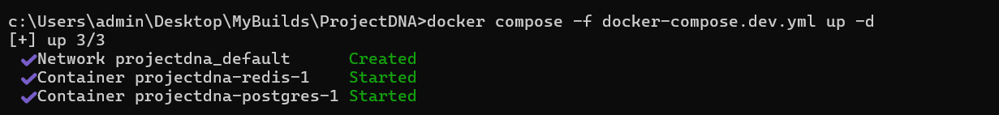

# ProjectDNA — Day 1: Foundation & Backend Scaffold

**Date:** July 9, 2026
**Goal:** Set up the complete project scaffold, database schema, authentication, and core API routes.

---

## What I Built

### 1. Monorepo Structure

```
projectdna/
├── server/          → Node.js + Express backend (port 3001)
├── client/          → React + TypeScript + Vite (port 5173)
├── ai-service/      → Python Flask AI microservice (port 5001)
├── docker-compose.dev.yml → Postgres + Redis (dev only)
├── .github/workflows/ci.yml → CI pipeline
└── docs/            → Daily build logs (you are here)
```

**Why this structure?**
- **Monorepo** keeps all services in one place - easier to manage for a solo/small team project.
- **Three separate services** allow independent scaling and language-appropriate tooling (Node for API, Python for ML/AI, React for UI).
- **Docker Compose for infra only** — Postgres and Redis run in containers, but app services run locally for fast iteration with hot-reload.

---

### 2. Database Schema (PostgreSQL)

Created **13 tables** upfront to avoid schema restructuring later:

| Table | Purpose |
|-------|---------|
| `users` | Auth & profiles (developer / mentor / admin roles) |
| `projects` | Core entity — each user owns multiple projects |
| `project_members` | Team membership with roles (owner / member / mentor) |
| `repositories` | GitHub repos linked to projects, stores indexed metadata |
| `repo_chunks` | RAG vector chunks — embedded text from repository content |
| `documents` | AI-generated & user-uploaded documentation |
| `tasks` | Kanban board items (todo / in_progress / done) |
| `timeline_events` | Project activity log |
| `feedback` | Mentor feedback by category |
| `interview_questions` | Question bank (AI-generated + user-added + interview experiences) |
| `notes` | Personal notes per project |
| `experiences` | Hackathon / interview / presentation logs |
| `chat_messages` | AI chat history per project |

**7 indexes** on the most-queried foreign keys (`projects.owner_id`, `tasks.project_id`, `tasks.status`, etc.)

**Architectural Decisions:**
- **UUIDs as primary keys** — avoids sequential ID enumeration attacks, works well in distributed systems.
- **`gen_random_uuid()`** — native Postgres function, no extension needed (Postgres 13+).
- **JSONB columns** for `folder_structure`, `tech_stack`, `dependencies`, `questions_asked` — flexible schema for GitHub metadata and interview data that varies per project.
- **CHECK constraints** on all enum-like columns — enforces valid values at the DB level, not just app level.
- **CASCADE deletes** — deleting a project cleans up all related data automatically.
- **Auto-migration on server startup** — `schema.sql` runs via `CREATE TABLE IF NOT EXISTS`, making it idempotent and safe to run on every boot.

---

### 3. Authentication System

**Stack:** `bcryptjs` for password hashing, `jsonwebtoken` for JWT tokens.

**Three middleware layers:**

| Middleware | Purpose |
|-----------|---------|
| `authenticate` | Verifies JWT from `Authorization: Bearer <token>` header |
| `authorize(...roles)` | Role-based access control (developer / mentor / admin) |
| `requireProjectAccess` | Checks `project_members` table — ensures user belongs to the project |

**Auth endpoints:**

| Method | Endpoint | Description |
|--------|----------|-------------|
| POST | `/api/auth/register` | Create account → returns JWT + user |
| POST | `/api/auth/login` | Validate credentials → returns JWT + user |
| GET | `/api/auth/me` | Get current user profile (protected) |

**Decisions:**
- **JWT with 7-day expiry** — long enough for dev convenience, short enough for security.
- **No refresh tokens yet** — can be added later if needed.
- **Password hash with cost factor 10** — good balance of security and speed.
- **Duplicate email returns 409** — catches Postgres unique constraint violation (`23505`).

---

### 4. Project & Task API

**Project routes (`/api/projects`):**

| Method | Endpoint | Description |
|--------|----------|-------------|
| POST | `/` | Create project + auto-add as owner + log timeline event |
| GET | `/` | List user's projects (via `project_members` JOIN) |
| GET | `/:projectId` | Get project with members list |
| POST | `/:projectId/members` | Invite member by email |

**GitHub integration (`/api/projects/:projectId/repository`):**

| Method | Endpoint | Description |
|--------|----------|-------------|
| POST | `/` | Connect GitHub repo → fetch README, folder structure, detect tech stack |
| GET | `/` | Get repository metadata |

**Task routes (`/api/projects/:projectId/tasks`):**

| Method | Endpoint | Description |
|--------|----------|-------------|
| GET | `/` | List tasks with assignee/creator names |
| POST | `/` | Create task → SSE broadcast |
| PATCH | `/:taskId` | Update task → SSE broadcast |
| DELETE | `/:taskId` | Delete task → SSE broadcast |

**Decisions:**
- **`mergeParams: true`** on nested routers — allows child routes to access `:projectId` from parent.
- **`ON CONFLICT DO NOTHING`** for member invites — prevents duplicate membership errors.
- **GitHub tech stack detection** — checks for `package.json` (Node.js) or `requirements.txt` (Python) to auto-detect stack.
- **Upsert for repositories** — `ON CONFLICT` update allows re-indexing without duplicate rows.

---

### 5. Real-Time Events (SSE)

**Server-Sent Events** for live Kanban board updates:

| Component | File | Purpose |
|-----------|------|---------|
| SSE Manager | `src/sse.js` | In-memory Map of `projectId → [response objects]` |
| SSE Route | `src/routes/sse.js` | `GET /api/projects/:projectId/events` — opens event stream |

**Event types broadcast:**
- `connected` — initial ping on connection
- `task_created` — new task added
- `task_updated` — task status/details changed
- `task_deleted` — task removed

**Why SSE over WebSocket?**
- Simpler — no handshake protocol, works over standard HTTP.
- One-directional (server → client) is all that's needed for notifications.
- Auto-reconnect built into the browser's `EventSource` API.
- Sufficient for this use case (Kanban updates, not a real-time chat).

---

### 6. AI Service (Flask — Placeholder)

Minimal Flask app with stub endpoints to be implemented on Day 2:

| Endpoint | Day 2 Purpose |
|----------|---------------|
| `GET /health` | Service health check ✅ Live |
| `POST /index` | RAG pipeline — chunk repo, generate embeddings, store in FAISS |
| `POST /chat` | Retrieve relevant chunks + call LLM |
| `POST /generate/documentation` | Documentation Agent |
| `POST /generate/interview-questions` | Interview Agent |
| `POST /generate/improvements` | Improvement Agent |

---

### 7. DevOps & CI

**Docker Compose (dev):**
- Postgres 15 Alpine on port `5433` (mapped from container's 5432 — avoids conflict with local Postgres)
- Redis 7 Alpine on port `6379`
- Named volumes (`pgdata`, `redisdata`) for data persistence across restarts

**GitHub Actions CI:**
- **Job 1: `test-and-build`** — runs on every push/PR to main. Installs server deps → runs tests → installs client deps → builds client.
- **Job 2: `deploy`** — runs only on push to main (not PRs). Placeholder for deployment step.

---

## Port Map

| Service | Port |
|---------|------|
| Express API | 3001 |
| Vite Dev Server | 5173 |
| Flask AI Service | 5001 |
| PostgreSQL | 5433 |
| Redis | 6379 |

---

## Terminal Screenshots

### Docker Compose Up


### Server Startup
<!-- npm run dev output showing "Schema ready" and "ProjectDNA server running on port 3001" 

### Health Check
<!-- Paste screenshot: curl http://localhost:3001/health returning {"status":"ok"} -->


### Register Test
<!-- Paste screenshot: curl -X POST http://localhost:3001/api/auth/register -H "Content-Type: application/json" -d '{"email":"test@test.com","password":"test123","display_name":"Test User"}' -->
> 📸 `[Paste terminal screenshot here]`

---

## Files Created Today

```
server/
├── server.js                    ← Entry point, auto-migrates schema
├── package.json                 ← Express + 7 dependencies
├── .env.example                 ← Environment variable template
└── src/
    ├── app.js                   ← Express app, wires all routes
    ├── sse.js                   ← SSE connection manager
    ├── db/
    │   ├── schema.sql           ← 13 tables + 7 indexes
    │   ├── index.js             ← pg.Pool connection
    │   └── migrate.js           ← Schema runner (standalone)
    ├── middleware/
    │   ├── auth.js              ← JWT + RBAC + project access
    │   └── logger.js            ← Request logger
    └── routes/
        ├── auth.js              ← Register / Login / Me
        ├── projects.js          ← CRUD + members
        ├── github.js            ← Repo connection + metadata
        ├── tasks.js             ← Kanban CRUD + SSE
        └── sse.js               ← Event stream endpoint

client/                          ← Vite React-TS scaffold (untouched)
ai-service/
├── app.py                       ← Flask with stub endpoints
├── requirements.txt             ← 11 pinned dependencies
└── .env.example                 ← AI service config

docker-compose.dev.yml           ← Postgres + Redis
.gitignore                       ← Node/Python/Terraform ignores
.github/workflows/ci.yml         ← CI pipeline
docs/
└── day1.md                      ← This file
```

---

## What's Next — Day 2

- [ ] Implement the RAG pipeline in `ai-service` (chunking, embeddings, FAISS)
- [ ] Wire up the AI chat endpoint with LLM integration
- [ ] Build Documentation, Interview, and Improvement agents
- [ ] Connect the Flask service to the Node server via `AI_SERVICE_URL`
- [ ] Begin React client setup (routing, auth pages, state management)
